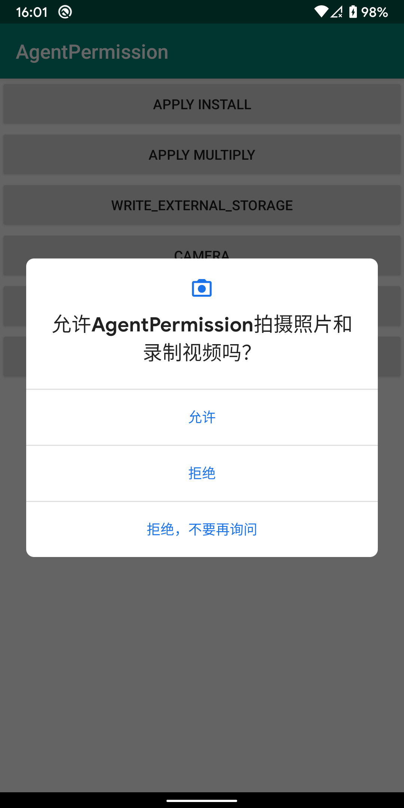

# AgentPermission

通过 `Fragment` 代理请求权限，屏蔽其中繁琐的检测、申请权限的方法，无需设置 `requestCode` 和重写 `onRequestPermissionsResult` ，拥有生命周期感知能力，在控制器执行到 `onDestroy` 时自动移除监听。



## 具体用法

1.请求运行时权限：

```java
AgentPermission.with(this)
        .runtime() // 运行时权限
        .permission(permissions) // 可接受单个或多个权限请求
        .rationale(new Rationale<List<String>>() {
            @Override
            public void showRationale(List<String> permissions, @NonNull final Requester requester) {
                // TODO 展示为何需要这些权限的说明，permissions 为需要展示说明的权限，如果不设置此回调则直接申请权限
              
                // 如果需要继续执行：
                requester.execute();
            }
        })
        .onGranted(new Result<List<String>>() {
            @Override
            public void onResult(List<String> permissions) {
                // 全部权限申请通过时的回调，permissions 为通过的权限
            }
        })
        .onDenied(new Result<List<String>>() {
            @Override
            public void onResult(List<String> permissions) {
                // 权限申请没有全部通过时的回调，permissions 为被拒绝的权限
            }
        })
        .start();
```


2.请求安装未知来源Apk：

```java
AgentPermission.with(MainActivity.this)
        .install() // 安装未知来源权限
        .rationale(new Rationale<Void>() {
            @Override
            public void showRationale(Void data, @NonNull final Requester requester) {
                // TODO 展示为何需要安装权限的说明，如果不设置此回调则直接申请权限
              
                // 如果需要继续执行：
                requester.execute();
            }
        })
        .onGranted(new Result<Void>() {
            @Override
            public void onResult(Void data) {
                // 获取权限成功的回调
            }
        })
        .onDenied(new Result<Void>() {
            @Override
            public void onResult(Void data) {
                // 获取权限失败的回调
            }
        })
        .start();
```


3.请求悬浮窗权限：

```java
AgentPermission.with(MainActivity.this)
        .overlays() // 悬浮窗权限
        .rationale(new Rationale<Void>() {
            @Override
            public void showRationale(Void data, @NonNull final Requester requester) {
                // TODO 展示为何需要安装权限的说明，如果不设置此回调则直接申请权限
              
                // 如果需要继续执行：
                requester.execute();
            }
        })
        .onGranted(new Result<Void>() {
            @Override
            public void onResult(Void data) {
                // 获取权限成功的回调
            }
        })
        .onDenied(new Result<Void>() {
            @Override
            public void onResult(Void data) {
                // 获取权限失败的回调
            }
        })
        .start();
```

## 感谢

[AndPermission](https://github.com/yanzhenjie/AndPermission)

`AndPermission` 是非常优秀的权限库，`AgentPermission` 借鉴了部分 Api 设计，不过核心实现原理不同，其他特殊的权限请求还在不断完善中。

## License

```
MIT License

Copyright (c) 2019 zerdaket

Permission is hereby granted, free of charge, to any person obtaining a copy
of this software and associated documentation files (the "Software"), to deal
in the Software without restriction, including without limitation the rights
to use, copy, modify, merge, publish, distribute, sublicense, and/or sell
copies of the Software, and to permit persons to whom the Software is
furnished to do so, subject to the following conditions:

The above copyright notice and this permission notice shall be included in all
copies or substantial portions of the Software.

THE SOFTWARE IS PROVIDED "AS IS", WITHOUT WARRANTY OF ANY KIND, EXPRESS OR
IMPLIED, INCLUDING BUT NOT LIMITED TO THE WARRANTIES OF MERCHANTABILITY,
FITNESS FOR A PARTICULAR PURPOSE AND NONINFRINGEMENT. IN NO EVENT SHALL THE
AUTHORS OR COPYRIGHT HOLDERS BE LIABLE FOR ANY CLAIM, DAMAGES OR OTHER
LIABILITY, WHETHER IN AN ACTION OF CONTRACT, TORT OR OTHERWISE, ARISING FROM,
OUT OF OR IN CONNECTION WITH THE SOFTWARE OR THE USE OR OTHER DEALINGS IN THE
SOFTWARE.
```
